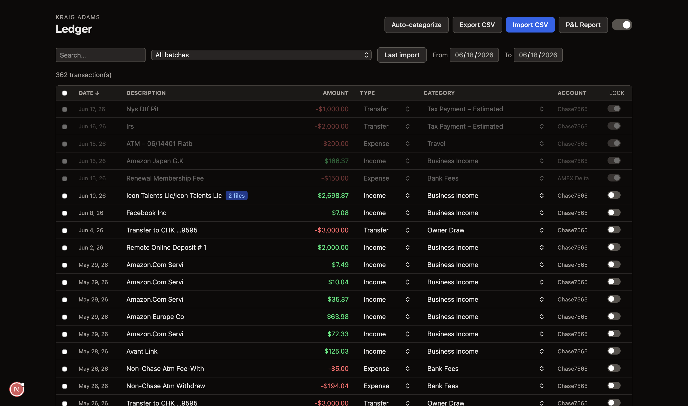
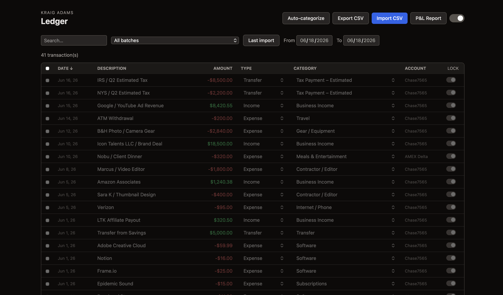
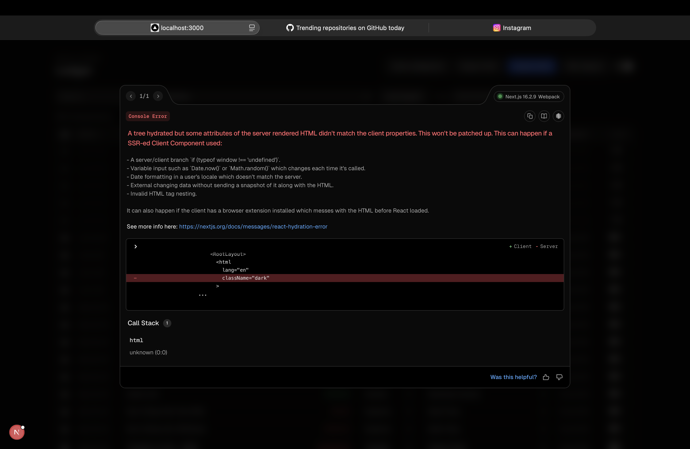
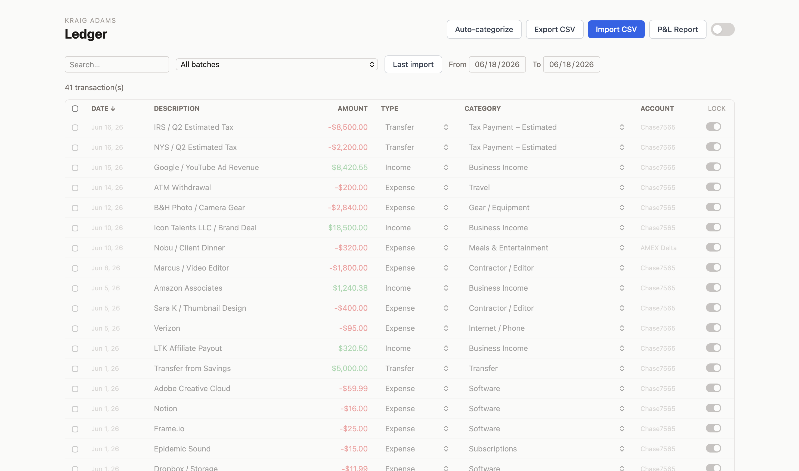

# Creator Bookkeeper

Local-first bookkeeping for solo creators and freelancers. Import bank CSVs, categorize transactions, generate a P&L, estimate quarterly taxes, and export Schedule C — entirely on your own machine. No cloud, no login, no subscription.

  

---

## Screenshots

| Ledger (dark) | Ledger (light) |
|---|---|
|  |  |

| P&L Report | Quarterly Tax Estimates |
|---|---|
|  |  |

---

## Features

- **CSV import** — upload bank or credit card exports, map columns visually, preview before committing
- **Transaction ledger** — inline editing of type, category, and notes; bulk actions; search and filter
- **Auto-categorize** — keyword rules map transactions to IRS Schedule C categories automatically
- **File attachments** — attach receipts and invoices to individual transactions (images are auto-compressed)
- **P&L report** — income vs. expenses by date range with year-over-year comparison
- **Quarterly tax estimates** — annualized federal + NY state estimates with payment tracking
- **Schedule C export** — one-click CSV with IRS line numbers ready to hand to your accountant
- **Light / dark mode** — toggle in the header, persists across sessions

---

## Requirements

- Node.js 20+
- npm

---

## Getting started

```bash
# 1. Clone
git clone https://github.com/kraigadams/creator-bookkeeper.git
cd creator-bookkeeper

# 2. Install dependencies
npm install

# 3. Create the database (run once)
node scripts/migrate.js

# 4. Start the dev server
npm run dev
```

Open [http://localhost:3000](http://localhost:3000).

---

## Project structure

```
src/
  app/
    page.tsx                  # Ledger (home)
    import/page.tsx           # CSV import wizard
    reports/page.tsx          # P&L + tax estimates
    api/
      upload/                 # Parse CSV, return headers + rows
      preview/                # Validate, normalize, flag duplicates
      import/                 # Commit to SQLite
      transactions/           # CRUD + bulk PATCH
      attachments/            # File upload, serve, delete
      recategorize/           # Auto-categorize all transactions
      export/csv/             # Full ledger CSV download
      reports/pnl/            # P&L aggregation
      reports/tax-payments/   # Quarterly payment lookup
  db/
    schema.ts                 # Drizzle table definitions
    index.ts                  # SQLite connection (WAL mode)
  lib/
    categorize.ts             # Keyword → Schedule C category rules
    validate.ts               # Row validation + amount parsing
    cleanDescription.ts       # Payee name normalization
    importSession.ts          # In-memory session (parse → confirm)
  components/
    ThemeToggle.tsx           # Light/dark toggle
scripts/
  migrate.js                  # One-time DB setup (no build step needed)
data/
  ledger.db                   # SQLite database (git-ignored)
  uploads/                    # Attached files (git-ignored)
```

---

## Tech stack

| | |
|---|---|
| Framework | Next.js 16 (App Router, webpack) |
| Database | SQLite via Drizzle ORM + better-sqlite3 |
| Styling | Tailwind CSS v4 |
| CSV parsing | PapaParse |
| File compression | Canvas API (client-side, images only) |

---

## Data privacy

Your database and uploaded files are stored locally in `data/` and are git-ignored. Nothing leaves your machine.

---

## License

MIT
